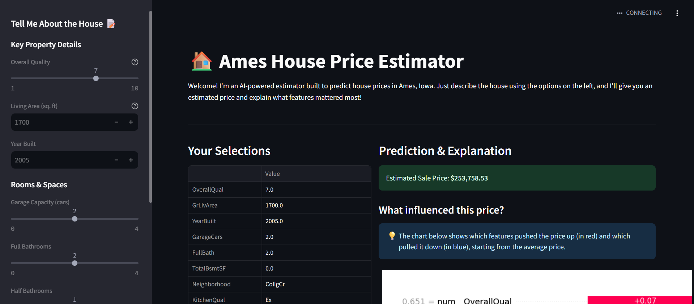
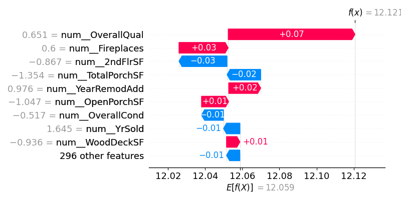

# 🏠 Ames Housing Price Predictor

[](https://www.google.com/search?q=https://your-streamlit-app-url.streamlit.app/) An interactive web application built with Streamlit that predicts house prices in Ames, Iowa, using a powerful XGBoost model. This project not only estimates prices but also provides model explanations using SHAP, making the AI's decisions transparent and understandable.

## ✨ Live Demo

**Experience the app live:** [https://your-streamlit-app-url.streamlit.app/](https://www.google.com/search?q=https://your-streamlit-app-url.streamlit.app/) ---

## 🚀 Key Features

  * **Interactive Price Prediction**: Adjust property features like living area, quality, and year built to get instant price estimates.
  * **AI-Powered Explanations**: Uses SHAP (SHapley Additive exPlanations) to generate a waterfall plot, showing exactly which features increased or decreased the predicted price.
  * **Vivid Data Analysis**: The accompanying Jupyter Notebook (`model_training.ipynb`) provides a deep-dive into the data with rich visualizations and feature engineering.
  * **Robust XGBoost Model**: Built on a carefully preprocessed dataset and trained using a robust pipeline for accurate predictions.

-----

## 🖼️ App Preview

Here's a glimpse of the application in action. The interface allows for easy input of house features, and the output provides a clear price prediction along with a detailed explanation chart.

\<p align="center"\>
\
\&nbsp; \&nbsp; \&nbsp;
\
\</p\>

-----

## 🛠️ Technologies Used

  * **Backend & Modeling**: Python, Pandas, Scikit-learn, XGBoost, SHAP
  * **Frontend Web App**: Streamlit, Streamlit-SHAP
  * **Data Analysis**: Jupyter Notebook, Matplotlib, Seaborn

-----

## ⚙️ Setup and Local Installation

To run this project on your local machine, follow these steps:

1.  **Clone the Repository**

    ```bash
    git clone https://github.com/your-username/your-repo-name.git
    cd your-repo-name
    ```

2.  **Create a Virtual Environment** (Recommended)

    ```bash
    python -m venv venv
    source venv/bin/activate  # On Windows, use `venv\Scripts\activate`
    ```

3.  **Install Dependencies**
    Make sure you have a `requirements.txt` file with all the necessary libraries.

    ```bash
    pip install -r requirements.txt
    ```

4.  **Download the Dataset**
    Download the `train.csv` file from the [Ames Housing Kaggle Page](https://www.kaggle.com/competitions/house-prices-advanced-regression-techniques/data) and place it in the root directory.

5.  **Generate the Model File**
    Run the `model_training.ipynb` Jupyter Notebook to perform the data analysis and generate the `ames_housing_pipeline.pkl` and `ames_model_features.pkl` files.

6.  **Run the Streamlit App**

    ```bash
    streamlit run app.py
    ```

    Your browser should open with the app running locally\!

-----

## 📂 Project Structure

```
your-repo-name/
│
├── model_training.ipynb      # Notebook for EDA, feature engineering, and model training.
├── app.py                      # The main Streamlit application script.
├── requirements.txt            # List of Python dependencies for the project.
│
├── ames_housing_pipeline.pkl   # (Generated) The saved, trained model pipeline.
├── ames_model_features.pkl     # (Generated) The list of features the model expects.
├── train.csv                   # The raw training data from Kaggle.
│
└── README.md                   # This file!
```

-----
